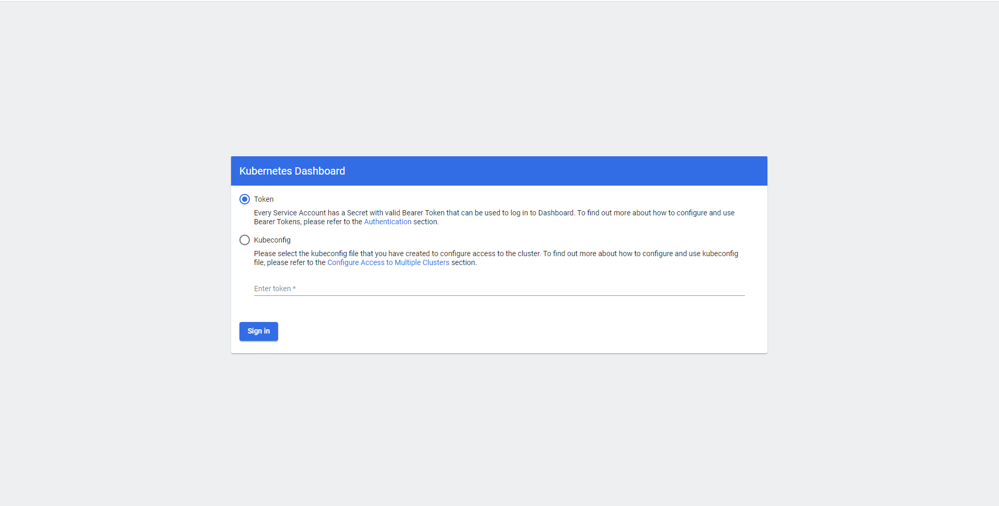
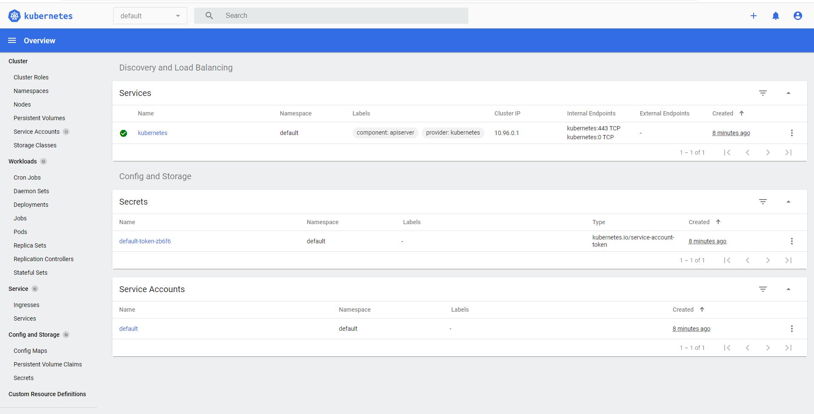
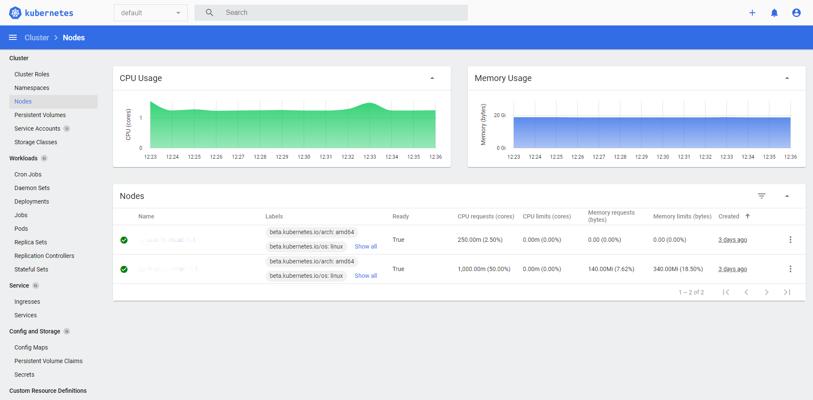
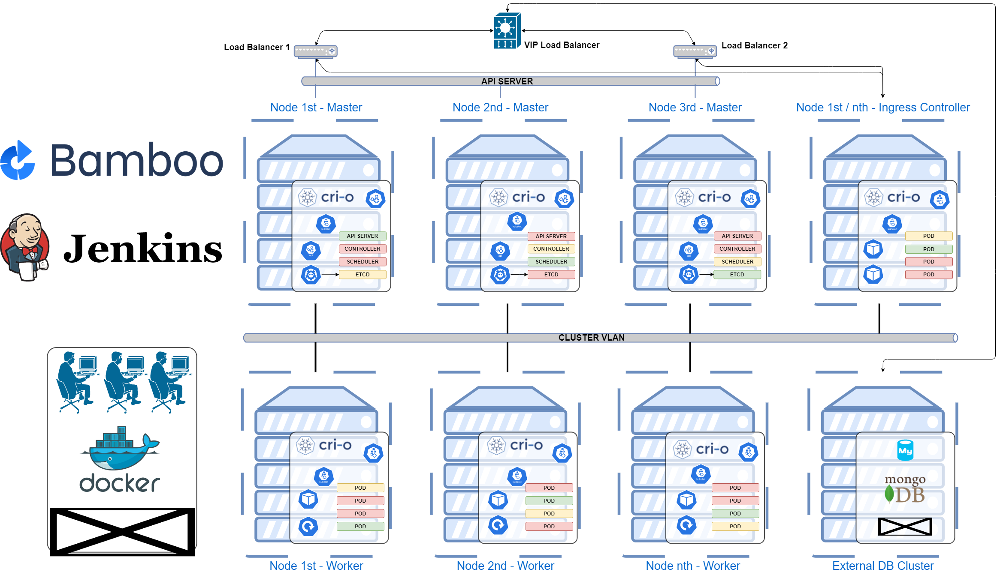
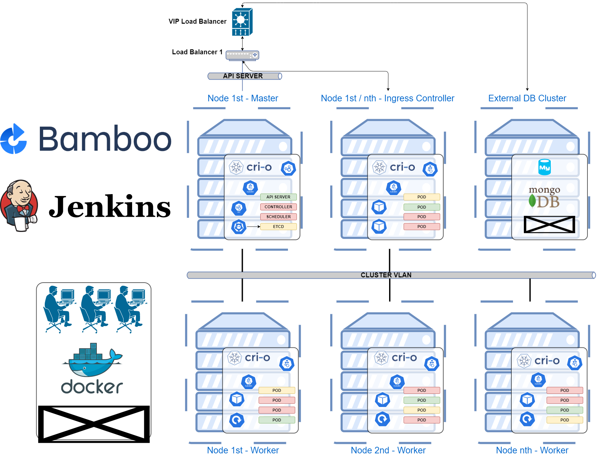

Role Name kubernetesMaster
=========

### How to download images through Docker
In case that they user has AD group access and he wasnt to update the core pods he / she needs to pull images from the web and push to Artifactory before proceeding. For example for metrics server:

```bash
docker pull k8s.gcr.io/metrics-server/metrics-server:v0.4.3
docker tag k8s.gcr.io/metrics-server/metrics-server:v0.4.3 my.private.docker.domain/metrics-server/metrics-server:v0.4.3
docker push my.private.docker.domain/metrics-server/metrics-server:v0.4.3
```

### Network Element Calico

This network element was choosen for this cluster [GitHub Calico](https://github.com/projectcalico/calico). The user who will choose to maintain should download the release-&lt;version&gt;.tgz, extract the content and then take file from manifest e.g. k8s-manifests/calico.yaml. Pull all images etc.

### Socket CRI-O or Docker

This role is using by default the CRI-O socket defined in the kubeadm config file (roles/kubernetesMaster/templates/kubeadm-config.yml.j2) in collaboration with the destroy script from role kubernetesCore (roles/kubernetesCore/templates/destroy.sh.j2). If the user desires to use the Docker socket the modification needs to be applied on both files changing the var from `kubernetes.socket.crio` to `kubernetes.socket.docker`.

This role is designed to create the Master Node (Primary). The script also launches the calico pod network element and also the dashboard UI. This script also uses [CRI-O](https://github.com/cri-o/cri-o) socket and not [Docker](https://docs.docker.com/engine/reference/commandline/dockerd/#daemon-socket-option) as it has been shown that is 15 times faster (sample of data below).

CRI-O is the OpenShift Container Runtime Interface [USING THE CRI-O CONTAINER ENGINE](https://access.redhat.com/documentation/en-us/openshift_container_platform/3.11/html/cri-o_runtime/use-crio-engine).

### What is the difference between Intel, AMD and ARM:
Intel and AMD processors are generally X86 architecture where as ARM processors are RISC processors based on ARM architecture.

# Chech the cpu architecture on the node:
```bash
where$ uname -p
x86_64
```

### Prepare k8s images for offline deployment

List images based on your kubeadm version (ignore the warninigns the community says it is not included error and it will be fixed in future):

```bash
$ kubeadm config images list
W1207 13:35:10.720697    3521 version.go:102] could not fetch a Kubernetes version from the internet: unable to get URL "https://dl.k8s.io/release/stable-1.txt": Get "https://dl.k8s.io/release/stable-1.txt": dial tcp 10.254.3.15:443: connect: connection refused
W1207 13:35:10.721218    3521 version.go:103] falling back to the local client version: v1.19.4
W1207 13:35:10.721671    3521 configset.go:348] WARNING: kubeadm cannot validate component configs for API groups [kubelet.config.k8s.io kubeproxy.config.k8s.io]
k8s.gcr.io/kube-apiserver:v1.19.4
k8s.gcr.io/kube-controller-manager:v1.19.4
k8s.gcr.io/kube-scheduler:v1.19.4
k8s.gcr.io/kube-proxy:v1.19.4
k8s.gcr.io/pause:3.2
k8s.gcr.io/etcd:3.4.13-0
k8s.gcr.io/coredns:1.7.0
```

Download images:

```bash
$ docker pull k8s.gcr.io/kube-apiserver:v1.19.4
v1.19.4: Pulling from kube-apiserver
b9cd0ea6c874: Pull complete
4900e6b31207: Pull complete
81975eb09f45: Pull complete
Digest: sha256:1d42d9b81ee77529c96080a1bb96d16e1988076400d3cf9e03c1ab2ec3df3374
Status: Downloaded newer image for k8s.gcr.io/kube-apiserver:v1.19.4
k8s.gcr.io/kube-apiserver:v1.19.4
```

Tag images:

```bash
$ docker tag k8s.gcr.io/kube-apiserver:v1.19.4 my.private.docker.domain/kube-apiserver:v1.19.4
```

Push images to my private repo:

```bash
docker push my.private.docker.domain/kube-apiserver:v1.19.4
The push refers to repository [my.private.docker.domain/kube-apiserver]
69bd40ef4722: Pushed
c12e92a17b61: Pushed
79d541cda6cb: Pushed
v1.19.4: digest: sha256:21e3568e7b62518b63d1cd5f2a99dd5afc79358d009f7ebfeef25c35e7fd9d5f size: 949
```

### CRI-O vs Docker speed comparison

Docker timing:

```bash
$ time sudo kubeadm config images pull --image-repository=rmy.private.docker.domain --kubernetes-version=v1.18.2 --cri-socket /var/run/dockershim.sock
W0624 10:49:15.966966   19555 configset.go:202] WARNING: kubeadm cannot validate component configs for API groups [kubelet.config.k8s.io kubeproxy.config.k8s.io]
[config/images] Pulled rmy.private.docker.domain/kube-apiserver:v1.18.2
[config/images] Pulled rmy.private.docker.domain/kube-controller-manager:v1.18.2
[config/images] Pulled rmy.private.docker.domain/kube-scheduler:v1.18.2
[config/images] Pulled rmy.private.docker.domain/kube-proxy:v1.18.2
[config/images] Pulled rmy.private.docker.domain/pause:3.2
[config/images] Pulled rmy.private.docker.domain/etcd:3.4.3-0
[config/images] Pulled rmy.private.docker.domain/coredns:1.6.7

real    0m16.021s
user    0m0.386s
sys     0m0.338s
```

CRI-O timing:

```bash
$ time sudo kubeadm config images pull --image-repository=rmy.private.docker.domain --kubernetes-version=v1.18.2 --cri-socket unix:///var/run/crio/crio.sock
W0624 10:50:23.089631   19991 configset.go:202] WARNING: kubeadm cannot validate component configs for API groups [kubelet.config.k8s.io kubeproxy.config.k8s.io]
[config/images] Pulled rmy.private.docker.domain/kube-apiserver:v1.18.2
[config/images] Pulled rmy.private.docker.domain/kube-controller-manager:v1.18.2
[config/images] Pulled rmy.private.docker.domain/kube-scheduler:v1.18.2
[config/images] Pulled rmy.private.docker.domain/kube-proxy:v1.18.2
[config/images] Pulled rmy.private.docker.domain/pause:3.2
[config/images] Pulled rmy.private.docker.domain/etcd:3.4.3-0
[config/images] Pulled rmy.private.docker.domain/coredns:1.6.7

real    0m1.144s
user    0m0.156s
sys     0m0.093s
```

Requirements
------------

The script should not be used in more than one node the Primary Master node. The rest of nodes should join the cluster and not launched as separate instances.

The user needs to install on the host where the deployment will be applied (localhost). The following packages are necessary for all deployment steps:                                                                                                                                                  

```bash
sudo -H python -m pip install openshift k8s hvac --upgrade # Python2
sudo -H python3 -m pip install openshift k8s hvac --upgrade # Python3
```

Role Variables
--------------

This role has variable in vars/main.yml, and inventory (dev / prod).

Dependencies
------------

The node that the user will decide to apply this script needs to be configured first with the kubernetesCore script that will prepare / configure all packages. Also there is dependency to first install the necessary packages and pip packages before proceeding with this script see relevant roles (installPackages and installPipPackages).

Example Playbook
----------------

`ansible-playbook -i inventories/development/hosts.yml -e ansible_user=<username> -e target_hosts=<target_hosts> roles/kubernetesMaster/tasks/main.yml -v`

Sample of Primare node after successful launch:

```bash
$ kubectl get nodes
NAME                   STATUS   ROLES    AGE    VERSION
k8sMasterNode1   Ready    master   109m   v1.18.2
```

Sample of Pods after node Master has successfuly started:

```bash
$ kubectl get pods -A
NAMESPACE              NAME                                            READY   STATUS    RESTARTS   AGE
cri-o-metrics-exporter   cri-o-metrics-exporter-6769b47f4f-qpjlg        0/1     Pending   0          16s
haproxy-controller       ingress-default-backend-5fd4986454-zc2dt       0/1     Pending   0          33s
kube-system              calico-kube-controllers-c64f7654c-6zmc5        1/1     Running   0          39s
kube-system              calico-node-ngdvk                              1/1     Running   0          39s
kube-system              coredns-7588b55795-qxgdb                       1/1     Running   0          80s
kube-system              coredns-7588b55795-vcp5g                       1/1     Running   0          80s
kube-system              etcd-k8sMasterNode                             1/1     Running   0          78s
kube-system              kube-apiserver-k8sMasterNode                   1/1     Running   0          78s
kube-system              kube-controller-manager-k8sMasterNode          1/1     Running   0          78s
kube-system              kube-proxy-rbcxt                               1/1     Running   0          80s
kube-system              kube-scheduler-k8sMasterNode                   1/1     Running   0          78s
kube-system              metrics-server-7dd6f575fd-7l2mr                0/1     Pending   0          19s
kubeless                 kubeless-controller-manager-6bf54784c9-xgxf6   0/3     Pending   0          1s
kubernetes-dashboard     dashboard-metrics-scraper-5f644f6df-9gpx9      1/1     Running   0          29s
kubernetes-dashboard     kubernetes-dashboard-85b6486959-ccqfm          1/1     Running   0          29s
```

You might notice that some of the pods e.g. "metrics-server-xxxx" is on Pending STATUS. This is absolutely normal as at this point we do not have a worker that the pod can be deployed. Once we join a worker on the cluster we will see the status changing e.g.:

```bash
$ kubectl get pods -A
NAMESPACE                NAME                                           READY   STATUS    RESTARTS   AGE
cri-o-metrics-exporter   cri-o-metrics-exporter-6769b47f4f-qpjlg        1/1     Running   0          93m
haproxy-controller       haproxy-ingress-l64bf                          1/1     Running   0          74m
haproxy-controller       ingress-default-backend-5fd4986454-zc2dt       1/1     Running   0          94m
kube-system              calico-kube-controllers-c64f7654c-6zmc5        1/1     Running   0          94m
kube-system              calico-node-2t5z9                              1/1     Running   0          92m
kube-system              calico-node-bkbc5                              1/1     Running   0          92m
kube-system              calico-node-ngdvk                              1/1     Running   0          94m
kube-system              calico-node-x7xtv                              1/1     Running   0          92m
kube-system              coredns-7588b55795-qxgdb                       1/1     Running   0          95m
kube-system              coredns-7588b55795-vcp5g                       1/1     Running   0          95m
kube-system              etcd-k8sMasterNode                             1/1     Running   0          95m
kube-system              kube-apiserver-k8sMasterNode                   1/1     Running   0          95m
kube-system              kube-controller-manager-k8sMasterNode          1/1     Running   0          95m
kube-system              kube-proxy-4qdrl                               1/1     Running   0          92m
kube-system              kube-proxy-fg2jz                               1/1     Running   0          92m
kube-system              kube-proxy-rbcxt                               1/1     Running   0          95m
kube-system              kube-proxy-tdmln                               1/1     Running   0          92m
kube-system              kube-scheduler-k8sMasterNode                   1/1     Running   0          95m
kube-system              metrics-server-7dd6f575fd-7l2mr                1/1     Running   0          94m
kubeless                 kubeless-controller-manager-6bf54784c9-xgxf6   3/3     Running   0          93m
kubernetes-dashboard     dashboard-metrics-scraper-5f644f6df-9gpx9      1/1     Running   0          94m
kubernetes-dashboard     kubernetes-dashboard-85b6486959-ccqfm          1/1     Running   0          94m
```

## UI Token
```bash
token:      eyJhbGciOiJSUzI1NiIsImtpZCI6ImJodGc1c0dSZ01KM1BsNE12RVBjNktJUmdsVi1yQ0lyMEliOUFuc2NtUzQifQ.eyJpc3MiOiJrdWJlcm5ldGVzL3NlcnZpY2VhY2NvdW50Iiwia3ViZXJuZXRlcy5pby9zZXJ2aWNlYWNjb3VudC9uYW1lc3BhY2UiOiJrdWJlcm5ldGVzLWRhc2hib2FyZCIsImt1YmVybmV0ZXMuaW8vc2VydmljZWFjY291bnQvc2VjcmV0Lm5hbWUiOiJhZG1pbi11c2VyLXRva2VuLWo1ZHRuIiwia3ViZXJuZXRlcy5pby9zZXJ2aWNlYWNjb3VudC9zZXJ2aWNlLWFjY291bnQubmFtZSI6ImFkbWluLXVzZXIiLCJrdWJlcm5ldGVzLmlvL3NlcnZpY2VhY2NvdW50L3NlcnZpY2UtYWNjb3VudC51aWQiOiJhNzY4Y2ZmYS1mYzhmLTRhMzktODFlYi0xYmM3NTFjMzdjOTIiLCJzdWIiOiJzeXN0ZW06c2VydmljZWFjY291bnQ6a3ViZXJuZXRlcy1kYXNoYm9hcmQ6YWRtaW4tdXNlciJ9.hL5R20qxWBW4Cw77yf4ZZFpdFfFBYdp4vjxgyu_LdgFW2ZF_eOGgKFj_wsbIXToeToNmF8_J27k0Fo-mSJT6821Wx9wt28HVDrbFiZZ5yA1BJ5iRKzc0x_0IUmFqQmshSqW2kDTBNatCfw5PyckPtlx1ZDudcqZ-uzpMlnSmejvjXuGyI1-4XTRhKVRIM-AfyzTK1yDUV-Av75ktxKfEkAZ50OIzb5X6HrHlKudaDaTHkToCrAqwbnelVD7hvYCKctqyebivmQPAXYlnO9c7NQbMi_hE1khIg-qazO3BOvmt_9KVx2AChOvDmHVdPQV_Vhvktss_waO28yx8Eq3idA
```

Example Metrics
---------------

## Sample of top nodes
```bash
$ kubectl top nodes
NAME                          CPU(cores)   CPU%   MEMORY(bytes)   MEMORY%
k8sMasterNode1   81m          4%     1373Mi          37%
k8sMasterNode2   152m         7%     1718Mi          46%
k8sMasterNode3   88m          2%     1682Mi          45%
k8sWorkerNode1   193m         1%     5288Mi          16%
```

## Sample of top pods
```bash
$ kubectl top pods -A
NAMESPACE                NAME                                           CPU(cores)   MEMORY(bytes)
cri-o-metrics-exporter   cri-o-metrics-exporter-6769b47f4f-qpjlg        1m           3Mi
haproxy-controller       haproxy-ingress-l64bf                          1m           83Mi
haproxy-controller       ingress-default-backend-5fd4986454-zc2dt       0m           0Mi
kube-system              calico-kube-controllers-c64f7654c-6zmc5        3m           10Mi
kube-system              calico-node-2t5z9                              22m          47Mi
kube-system              calico-node-bkbc5                              21m          45Mi
kube-system              calico-node-ngdvk                              22m          50Mi
kube-system              calico-node-x7xtv                              23m          45Mi
kube-system              coredns-7588b55795-qxgdb                       3m           9Mi
kube-system              coredns-7588b55795-vcp5g                       3m           9Mi
kube-system              etcd-k8sMasterNode                             19m          50Mi
kube-system              kube-apiserver-k8sMasterNode                   45m          341Mi
kube-system              kube-controller-manager-k8sMasterNode          11m          51Mi
kube-system              kube-proxy-4qdrl                               1m           12Mi
kube-system              kube-proxy-fg2jz                               1m           12Mi
kube-system              kube-proxy-rbcxt                               1m           13Mi
kube-system              kube-proxy-tdmln                               1m           11Mi
kube-system              kube-scheduler-k8sMasterNode                   3m           19Mi
kube-system              metrics-server-7dd6f575fd-7l2mr                3m           14Mi
kubeless                 kubeless-controller-manager-6bf54784c9-xgxf6   3m           15Mi
kubernetes-dashboard     dashboard-metrics-scraper-5f644f6df-9gpx9      1m           4Mi
kubernetes-dashboard     kubernetes-dashboard-85b6486959-ccqfm          1m           12Mi
```

Documentation regarding the CPU untis [Assign CPU Resources to Containers and Pods/cpu-units](https://kubernetes.io/docs/tasks/configure-pod-container/assign-cpu-resource/#cpu-units)

### Notes

Sample of Dashboard UI login:



Sample of Dashboard UI logged in (no pods):



Sample of Dashboard UI Metrics:



Sample of High Availability K8s cluster:



Sample of Minimal Availability K8s cluster:



License
-------

BSD

Author Information
------------------

Athanasios Garyfalos. Email: garyfalos@cpan.org
